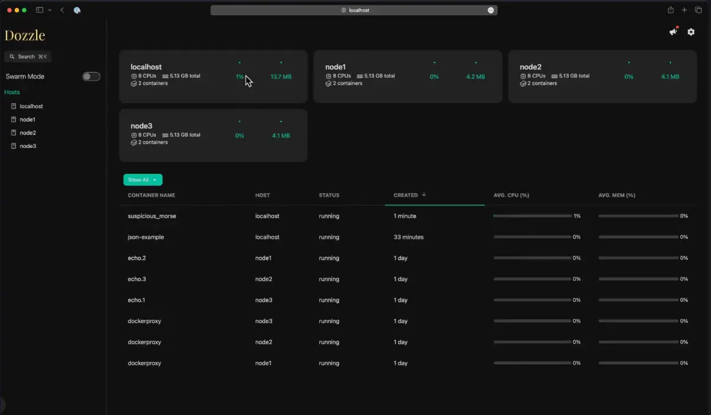

<h1>🫵 Dozzle for container insights</h1>

Dozzle was a solution I just discovered not too long ago and realized what a great little tool it is. It lets you have a quick and easy view of your container logs across many different container hosts. With this, you can quickly view the logs for your containers no matter which host they are running on, without having to SSH into your Docker container hosts and run a docker logs <container name> command.

