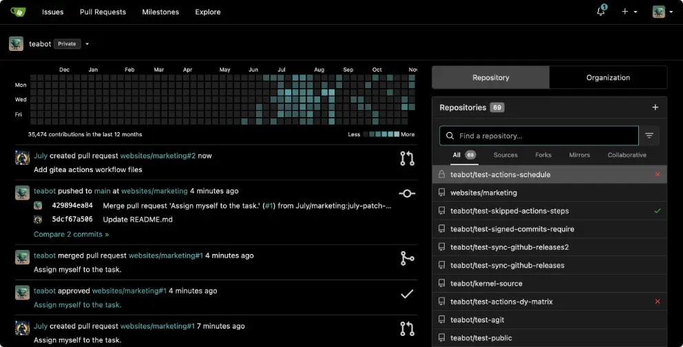

<h1 style="color:blue;">Gitea for Self-Hosted Git Repositories</h1>

Having your own self-hosted code repo is the way to go to start learning DevOps and infrastructure as code. It will help you get up to speed very quickly with git commands and learn the workflows of DevOps. Of course, the next decision is which solution should you host? Well, that is where Gitea is quickly becoming a favorite, due to the fact it is lightweight and it is almost a clone it looks like of GitHub which many are familiar with. I still prefer GitLab over all other solutions, but to begin with if you are looking for a Docker solution for code repo, Gitea is a great place to start.
