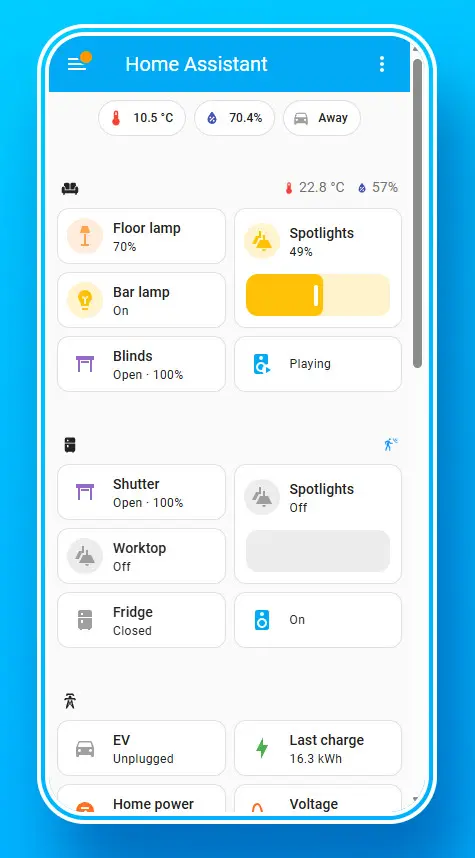

<h1>🏠 Home Assistant to get into smart home tech</h1>

The [Home Assistant](https://www.home-assistant.io) solution is absolutely the defacto standard in smart home self-hosting technologies. It is a complete management system for all of your smart home devices and allows you to control them from a single pane of glass interface.

provides side car containers for use in forwarding messages if you need to your HomeAssistant environment.

