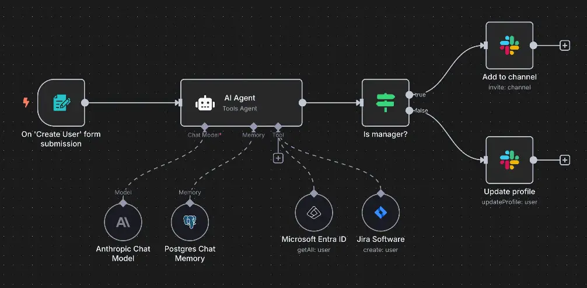

<h1>🎆 N8N to automate your workflows</h1>

The [n8n](https://n8n.io/) solution is one of the coolest automation tools I have seen. It provides an easy way to automate entire workflows so that it takes the heavy lifting out of the process. You can think of it like your own self-hosted Zapier that provides hooks into just about any API solution out there. You can use it for automating Git updates, email alerts, file movements, or even things like Home Assistant triggers.

