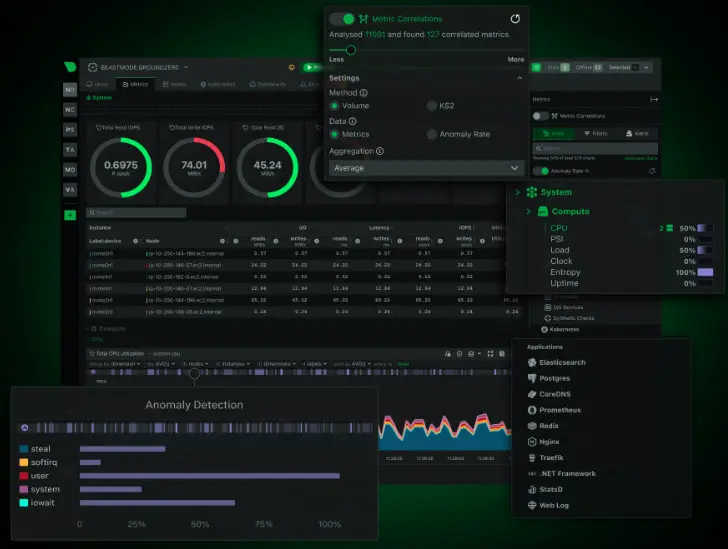

<h1>📊 Netdata for home lab monitoring</h1>

Netdata is one of the easiest monitoring solutions you will find for monitoring your home lab environment. It is easily installed with a lightweight agent that you install on your Linux and Windows hosts, and it picks up Docker containers you are running as well as Kubernetes metrics. And, I like that it is a simple container that you provision for getting it spun up.

