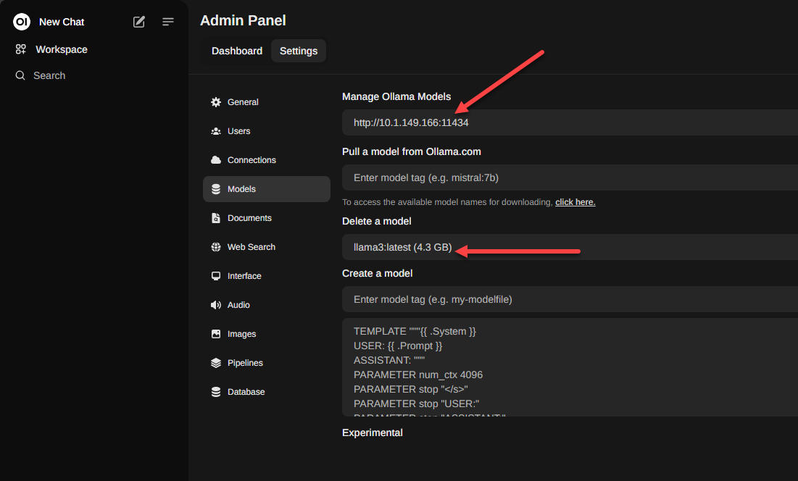

<h1>🕸️ OpenWebUI + Ollama for self-hosted AI at home</h1>

This is a pair of solutions I have been playing around with the past few months and I have to say that self-hosting your own AI server is totally awesome. You don’t have to worry about API costs to the major cloud AI providers, and you keep control of your own data.

Also, it is not as hard as you might imagine to self-host your own AI either. With [OpenWebUI](https://github.com/open-webui/open-webui) and [Ollama](https://ollama.com/), you have a very ChatGPT like experience from the comforts of your own home lab.

