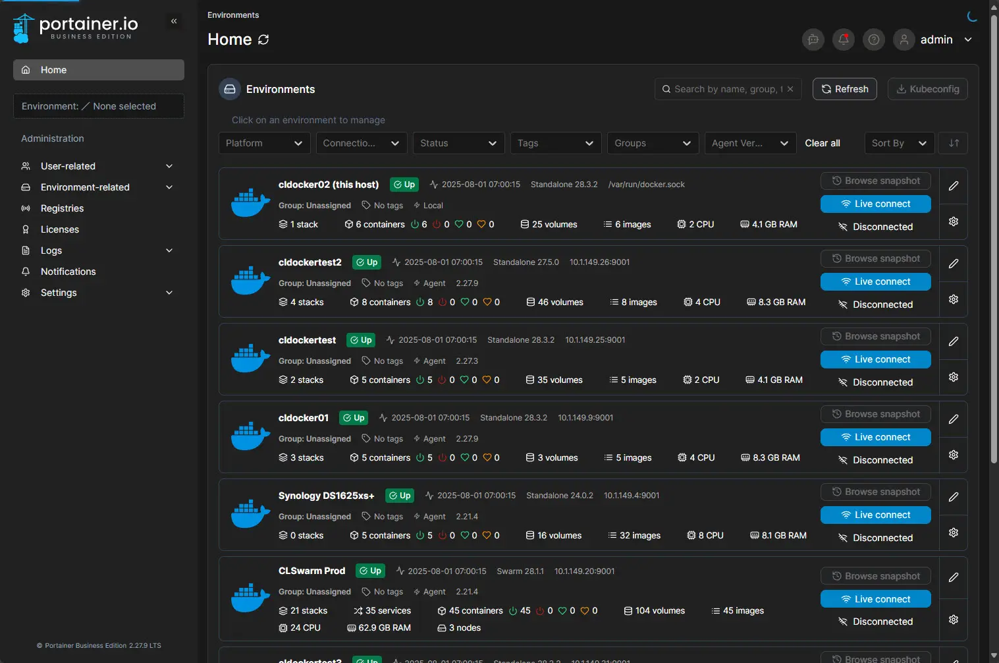

<h1>💨 Portainer is the best GUI for Docker</h1>

If you are looking for the best all around management tool for your Docker containers, Portainer is it. There are other free and open source tools out there, but I have tried them all and there are just none as polished and feature-rich as Portainer. If you don’t currently have a tool to manage your containers across hosts, do yourself a favor and implement Portainer over a weekend project and you will quickly reap the rewards of better management.

Portainer is also one of the best tools you can use if you are delving into Docker Swarm. It absolutely makes the Docker Swarm solution viable in my opinion with the great management features.

