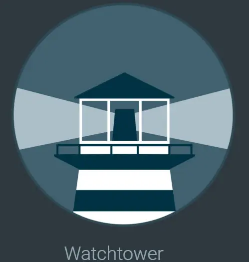

<h1>⌚ Watchtower to keep your containers updated</h1>

If there is a solution that helps you with lifecycle management with Docker, it is Watchtower. Watchtower is a solution that, on a schedule, checks yours containers to see if there is a new container image available. If it finds one it stops the container, pulls the new image, and restarts the container with the same configuration using the new image. Pretty cool. In case you are running Docker Swarm, there is a counterpart to Watchtower called Shepherd. It does basically the same thing with your Docker services.

Here is sample Docker Compose code that will get a basic instance of Watchtower up and running for you. The cleanup parameter tells Watchtower to clean up the old images which helps with housekeeping for your disk space.

